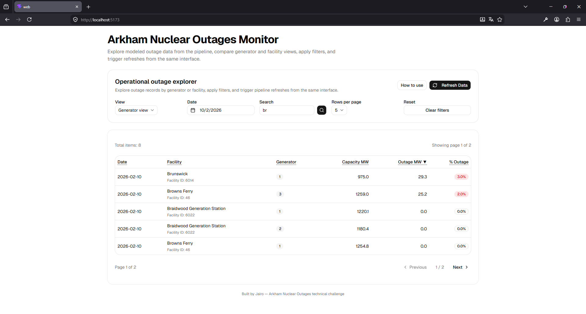

# Arkham Nuclear Outages

A local-first data pipeline and dashboard for extracting, modeling, querying, and visualizing Nuclear Outages data from the EIA Open Data API.

This project covers the full challenge flow:

- **Data Connector**: paginated extraction from the EIA API into Parquet with **incremental extraction**
- **Data Model**: normalization into a simple relational model with 3 tables
- **Simple API**: query and refresh endpoints with lightweight **authentication / authorization**
- **Data Preview Interface**: a web UI with filtering, sorting, pagination, refresh, and friendly loading / empty / error states

---

## Tech Stack

### Backend
- **Python**
- **FastAPI**
- **Polars**
- **Pydantic / Pydantic Settings**

### Frontend
- **React**
- **TypeScript**
- **Vite**
- **TanStack Query**
- **shadcn/ui**
- **Tailwind CSS**

### Storage
- **Parquet**

---

## Project Structure

```text
arkham-nuclear-outages/
├─ apps/
│  ├─ api/                              # Backend application
│  │  ├─ app/
│  │  │  ├─ api/                        # HTTP layer: routes, dependencies, request handling
│  │  │  ├─ connectors/                 # External integrations such as the EIA API client
│  │  │  ├─ core/                       # Shared configuration and centralized logging
│  │  │  ├─ schemas/                    # Pydantic contracts for requests and responses
│  │  │  ├─ services/                   # Business logic: extract, transform, query, refresh
│  │  │  └─ main.py                     # FastAPI application entry point
│  │  ├─ scripts/
│  │  │  └─ run_pipeline.py             # Manual pipeline runner: extract + transform
│  │  ├─ tests/                         # Backend tests / manual validation scripts
│  │  └─ requirements.txt               # Python dependencies
│  │
│  └─ web/                              # Frontend application
│     ├─ src/
│     │  ├─ api/                        # Frontend API clients
│     │  ├─ components/                 # UI and feature components
│     │  ├─ hooks/                      # React hooks
│     │  ├─ lib/                        # Shared frontend utilities
│     │  ├─ App.tsx                     # Root component
│     │  ├─ main.tsx                    # Frontend entry point
│     │  └─ index.css                   # Global styles
│     ├─ .env.example                   # Frontend environment variable example
│     ├─ package.json                   # Frontend dependencies and scripts
│     └─ vite.config.ts                 # Vite configuration
│
├─ data/
│  ├─ raw/                              # Raw Parquet extracted from EIA
│  ├─ model/                            # Normalized Parquet tables
│  └─ state/                            # Extraction state for incremental runs
│
├─ docs/
│  └─ ER_Diagram.png                    # ER diagram
│
├─ logs/                                # Application logs
├─ .env.example                         # Backend environment variable example
└─ README.md
```

---

## Data Model

The dataset is normalized into **3 tables**, with **generator-level outages** as the primary source of truth.

### Design Rationale

Generator-level outages were chosen as the main source because they preserve the highest operational granularity and make it possible to identify which specific generator is affected. A facility-level view is then derived from the same modeled data to support aggregated analysis.

### Table Definitions

#### 1. `facilities`
Facility-level reference table.

| Column | Type | Description |
|--------|------|-------------|
| facility_id | PK | Unique facility identifier |
| facility_name | string | Human-readable facility name |

#### 2. `generators`
Generator-level reference table.

| Column | Type | Description |
|--------|------|-------------|
| generator_id | PK | Derived generator identifier |
| facility_id | FK → facilities.facility_id | Parent facility |
| generator_code | string | Generator code within the facility |

**Design note**: `generator_id` is derived as `facility_id + "_" + generator_code` because `generator_code` alone is not globally unique across all facilities.

#### 3. `outages`
Daily outage fact table at generator-level granularity.

| Column | Type | Description |
|--------|------|-------------|
| period_date | date | Reporting date |
| generator_id | FK → generators.generator_id | Generator reference |
| capacity_mw | float | Installed capacity in megawatts |
| outage_mw | float | Outage capacity in megawatts |
| percent_outage | float | Percentage of capacity affected |

**Logical primary key**: `(period_date, generator_id)`

### ER Diagram

The ER diagram:


---

## Authentication & Authorization

A lightweight API-key-based access control layer was added to the API service.

**Header**: `X-Arkham-API-Key`

| Endpoint | Read Key | Admin Key |
|----------|----------|-----------|
| `GET /data` | ✅ | ✅ |
| `POST /refresh` | ❌ | ✅ |

This approach is intentionally simple and appropriate for the scope of the challenge.

---

## API Overview

### `GET /data`

Returns outage data with filtering, sorting, and pagination.

**Authentication**: Read API key or Admin API key required

#### Query Parameters

| Parameter | Values | Description |
|-----------|--------|-------------|
| `view` | `generator` \| `facility` | Data view type |
| `date` | `YYYY-MM-DD` | Exact date filter |
| `search` | string | Free-text search |
| `page` | integer | Page number (1-indexed) |
| `page_size` | integer | Rows per page |
| `sort_by` | string | Column name to sort by |
| `sort_order` | `asc` \| `desc` | Sort direction |

#### Example Request

```bash
curl -X GET "http://127.0.0.1:8000/data?view=generator&page=1&page_size=10&sort_by=period_date&sort_order=desc" \
  -H "X-Arkham-API-Key: YOUR_READ_API_KEY"
```

#### Example Response

```json
{
  "view": "generator",
  "page": 1,
  "page_size": 10,
  "total_items": 694042,
  "total_pages": 69405,
  "items": [
    {
      "period_date": "2026-03-27",
      "generator_id": "8055_1",
      "generator_code": "1",
      "facility_id": "8055",
      "facility_name": "Arkansas Nuclear One",
      "capacity_mw": 848.8,
      "outage_mw": 0.0,
      "percent_outage": 0.0
    }
  ]
}
```

---

### `POST /refresh`

Triggers the data refresh pipeline (extract + transform + model rebuild).

**Authentication**: Admin API key required

#### Request Body

```json
{
  "mode": "auto"
}
```

#### Supported Modes

- `auto` — lets the extraction service decide between full, resume, or incremental extraction
- `full` — forces a full extraction from scratch

#### Example Request

```bash
curl -X POST "http://127.0.0.1:8000/refresh" \
  -H "Content-Type: application/json" \
  -H "X-Arkham-API-Key: YOUR_ADMIN_API_KEY" \
  -d "{\"mode\":\"auto\"}"
```

#### Example Response

```json
{
  "status": "success",
  "requested_mode": "auto",
  "extract": {
    "mode": "incremental",
    "total_rows_reported": 694042,
    "total_rows_valid": 95,
    "pages_processed": 2,
    "pages_failed": 0
  },
  "transform": {
    "raw_rows": 694042,
    "facilities_rows": 99,
    "generators_rows": 104,
    "outages_rows": 694042
  }
}
```

---

## Logging

The project uses two complementary logging layers:

- **Uvicorn access logs** in the console for incoming HTTP requests and status codes
- **Application logs** in `logs/app.log` for extraction, transformation, query, and refresh flow

Application logs are rotated daily and are the main source for troubleshooting backend behavior.

---

## Environment Variables

### 1. EIA API Key (Backend)

To access the EIA Open Data API, create an API key here:

```text
https://www.eia.gov/opendata/
```

This key is required in the backend root `.env` as:

```dotenv
EIA_API_KEY=YOUR_EIA_API_KEY
```

### 2. Backend (`.env` at project root)

Create a `.env` file in the **project root** by copying `.env.example`:

#### Windows
```bash
copy .env.example .env
```

#### Linux / macOS
```bash
cp .env.example .env
```

Then edit it with:

```dotenv
# EIA API configuration
EIA_API_KEY=YOUR_EIA_API_KEY
EIA_ENDPOINT=/nuclear-outages/generator-nuclear-outages/data/

# Request behavior
REQUEST_TIMEOUT_SECONDS=15
PAGE_SIZE=5000
MAX_RETRIES=3
RETRY_BACKOFF_SECONDS=1.5

# Logging
LOG_LEVEL=INFO
LOG_RETENTION_DAYS=14

# Internal API keys
arkham_nuclear_read_api_key=YOUR_READ_API_KEY
arkham_nuclear_admin_api_key=YOUR_ADMIN_API_KEY
```

### 3. Frontend (`apps/web/.env`)

Create a `.env` file inside `apps/web` by copying `apps/web/.env.example`:

#### Windows
```bash
cd apps\web
copy .env.example .env
```

#### Linux / macOS
```bash
cd apps/web
cp .env.example .env
```

Then edit it with:

```dotenv
VITE_API_BASE_URL=http://127.0.0.1:8000
VITE_ARKHAM_API_KEY=YOUR_READ_API_KEY
VITE_ARKHAM_ADMIN_API_KEY=YOUR_ADMIN_API_KEY
```

### 4. Generate Internal API Keys (Read/Admin)

These are the project’s own internal API keys used to protect `/data` and `/refresh`.

Generate them from the backend environment:

#### Windows
```bash
cd apps\api
.\venv\Scripts\activate
python -c "import secrets; print('READ=' + secrets.token_urlsafe(32)); print('ADMIN=' + secrets.token_urlsafe(32))"
```

#### Linux / macOS
```bash
cd apps/api
source venv/bin/activate
python -c "import secrets; print('READ=' + secrets.token_urlsafe(32)); print('ADMIN=' + secrets.token_urlsafe(32))"
```

Use the generated values in these variables:

#### Backend root `.env`
```dotenv
arkham_nuclear_read_api_key=YOUR_GENERATED_READ_KEY
arkham_nuclear_admin_api_key=YOUR_GENERATED_ADMIN_KEY
```

#### Frontend `apps/web/.env`
```dotenv
VITE_ARKHAM_API_KEY=YOUR_GENERATED_READ_KEY
VITE_ARKHAM_ADMIN_API_KEY=YOUR_GENERATED_ADMIN_KEY
```

---

## Quick Start (Local)

Before starting, make sure you have the following installed:

- **Python 3**
- **Node.js and npm**

### 1. Clone the repository

```bash
git clone https://github.com/JairoHervert/Arkham-nuclear-outages
cd Arkham-nuclear-outages
```

### 2. Backend setup

#### Windows
```bash
cd apps\api
python -m venv venv
.\venv\Scripts\activate
pip install -r requirements.txt
cd ..\..
copy .env.example .env
```

#### Linux / macOS
```bash
cd apps/api
python -m venv venv
source venv/bin/activate
pip install -r requirements.txt
cd ../..
cp .env.example .env
```

After copying the file, edit the root `.env` and add:
- EIA API key
- read/admin internal API keys

### 3. Frontend setup

#### Windows
```bash
cd apps\web
npm install
copy .env.example .env
```

#### Linux / macOS
```bash
cd apps/web
npm install
cp .env.example .env
```

After copying the file, edit `apps/web/.env` and add:
- backend base URL
- read/admin frontend API keys

### 4. Run the backend

From `apps/api`:

```bash
python -m uvicorn app.main:app --reload
```

Backend URLs:
- Base API: `http://127.0.0.1:8000`
- Docs / Swagger: `http://127.0.0.1:8000/docs`
- Query endpoint: `http://127.0.0.1:8000/data`
- Refresh endpoint: `http://127.0.0.1:8000/refresh`

### 5. Run the frontend

From `apps/web`:

```bash
npm run dev
```

Open the dashboard at the default Vite development URL shown in the terminal (commonly `http://127.0.0.1:5173` or `http://localhost:5173`).

---

## Data Pipeline

The project includes a dedicated pipeline script that:
1. extracts data from the EIA API
2. stores the raw dataset as Parquet
3. transforms the raw dataset into the modeled tables:
   - `facilities.parquet`
   - `generators.parquet`
   - `outages.parquet`

### Run the pipeline manually

#### Windows
```bash
cd apps\api
.\venv\Scripts\python.exe .\scripts\run_pipeline.py
```

#### Linux / macOS
```bash
cd apps/api
source venv/bin/activate
python scripts/run_pipeline.py
```

### Force a full extraction

#### Windows
```bash
cd apps\api
.\venv\Scripts\python.exe .\scripts\run_pipeline.py --mode full
```

#### Linux / macOS
```bash
cd apps/api
source venv/bin/activate
python scripts/run_pipeline.py --mode full
```

### Alternative
The first data download can also be triggered from the frontend with the **Refresh Data** button.

---

## Recommended First Run

1. Configure backend `.env`
2. Configure frontend `apps/web/.env`
3. Run the backend
4. Run the frontend
5. Open the dashboard
6. If no modeled data exists yet, click **Refresh Data**
7. Optionally, you may run the pipeline manually first using `run_pipeline.py`

---

## Frontend Features

- generator and facility views
- server-side filtering, sorting, and pagination
- refresh action from the UI
- loading, missing-data, empty-state, and API error handling
- help dialog and column tooltips
- responsive layout with Tailwind CSS and shadcn/ui

---

## Design Decisions

- **Polars over Pandas** for multi-threaded processing and memory efficiency on a dataset of roughly 700k records
- **Parquet** as the primary storage layer for efficient columnar reads and writes
- **Simple 3-table model** to keep the solution easy to understand and query
- **Generator-level source** as the main operational granularity, with facility-level summaries derived from it
- **Derived `generator_id`** to ensure global uniqueness and simplify joins
- **Server-side filtering, sorting, and pagination** to keep the frontend lightweight
- **Lightweight API-key auth** as a practical solution for the scope of this challenge
- **Functional folder structure** so backend, frontend, data, and documentation remain clearly separated

---

## Troubleshooting

### Dashboard says no processed data is available
No modeled parquet files have been generated yet. Use **Refresh Data** in the frontend or run `run_pipeline.py` manually.

### Frontend cannot reach backend
Check:
- backend is running
- `VITE_API_BASE_URL` is correct
- CORS is enabled for the frontend origin

### Data access is unauthorized
Check that the frontend keys in `apps/web/.env` match the backend keys in the root `.env`.

### EIA refresh fails
Verify that `EIA_API_KEY` in the root `.env` is valid and that the backend can reach the EIA API.

---

## Dashboard Screenshot

Example:



---

## Author

Built by **Jairo** as a technical challenge submission for Arkham Technologies.
