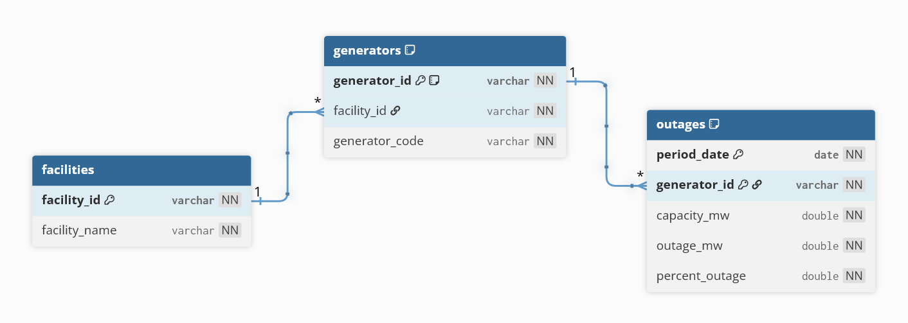

# Arkham Nuclear Outages

A local-first data pipeline and dashboard for extracting, modeling, querying, and visualizing Nuclear Outages data from the EIA Open Data API.

---

## Overview

This project covers the full challenge flow:

- **Data Connector**: paginated extraction from the EIA API into Parquet
- **Data Model**: normalization into a simple relational model  
- **Simple API**: query and refresh endpoints with authentication/authorization
- **Data Preview Interface**: a web UI with filtering, sorting, pagination, refresh, and user-friendly states

---

## Tech Stack

### Backend
- **Python** - Core runtime
- **FastAPI** - REST API framework
- **Polars** - High-performance data processing
  - *Elegí Polars por su capacidad de procesamiento multi-hilo y eficiencia en memoria para manejar el volumen de ~700k registros del dataset de la EIA*
- **Pydantic / Pydantic Settings** - Data validation and configuration management

### Frontend
- React
- TypeScript
- Vite
- TanStack Query
- shadcn/ui
- Tailwind CSS

### Storage
- Parquet (columnar, efficient storage format)

---

## Project Structure

```
arkham-nuclear-outages/
├─ apps/
│  ├─ api/                              # Backend application
│  │  ├─ app/
│  │  │  ├─ api/                        # HTTP layer: routes, dependencies
│  │  │  ├─ connectors/                 # External integrations (EIA API client)
│  │  │  ├─ core/                       # Shared configuration and logging
│  │  │  ├─ schemas/                    # Pydantic schemas
│  │  │  ├─ services/                   # Business logic: extract, transform, query
│  │  │  └─ main.py                     # FastAPI application entry point
│  │  ├─ scripts/
│  │  │  └─ run_pipeline.py             # Data pipeline orchestration script
│  │  ├─ tests/                         # Backend tests
│  │  └─ requirements.txt               # Python dependencies
│  │
│  └─ web/                              # Frontend application
│     ├─ src/
│     │  ├─ api/                        # Frontend API clients
│     │  ├─ components/                 # UI components
│     │  ├─ hooks/                      # React hooks
│     │  ├─ lib/                        # Shared utilities
│     │  ├─ App.tsx                     # Root component
│     │  ├─ main.tsx                    # Frontend entry point
│     │  └─ index.css                   # Global styles
│     ├─ .env.example                   # Example environment variables
│     ├─ package.json                   # Dependencies and scripts
│     └─ vite.config.ts                 # Vite configuration
│
├─ data/
│  ├─ raw/                              # Raw Parquet from EIA
│  ├─ model/                            # Normalized Parquet tables
│  └─ state/                            # Extraction state for incremental runs
│
├─ docs/
│  └─ erd.png                           # ER diagram
│
├─ logs/                                # Application logs (rotated daily)
├─ .env.example                         # Example environment variables
└─ README.md
```

### Architecture Rationale

The folder structure is organized around **functional domains** (api, web, data, docs) rather than technical layers. This approach:
- Separates concerns clearly (backend, frontend, data storage, documentation)
- Allows scaling of each component independently
- Makes it easy to locate and modify features within each domain
- Supports future growth without major restructuring

---

## Data Model

The dataset is normalized into **3 tables**, with **generator-level outages** as the primary source of truth.

### Design Rationale

Se eligió **Generator-level outages** como fuente principal para conservar el mayor nivel de detalle operativo posible y permitir identificar qué generador presenta afectaciones. A partir de esta fuente también se construye una vista agregada por planta para facilitar el análisis general.

This dual-level approach provides:
- **Operational precision**: Identify specific generator failures and impacts
- **Plant-level analysis**: Aggregate views for facility-wide operational insights
- **Flexibility**: Support both detailed and summarized reporting

### Table Definitions

#### 1. `facilities`
Facility-level reference table.

| Column | Type | Description |
|--------|------|-------------|
| facility_id | PK | Unique facility identifier |
| facility_name | string | Human-readable facility name |

#### 2. `generators`
Generator-level reference table.

| Column | Type | Description |
|--------|------|-------------|
| generator_id | PK | Composite identifier (derived) |
| facility_id | FK → facilities.facility_id | Reference to parent facility |
| generator_code | string | Generator code within facility |

**Design Note**: `generator_id` is derived as `facility_id + "_" + generator_code` because:
- `generator_code` alone is not globally unique across all facilities
- A composite identifier simplifies joins in queries by using a single column instead of a composite key

#### 3. `outages`
Daily outage fact table (generator-level granularity).

| Column | Type | Description |
|--------|------|-------------|
| period_date | date | Reporting date |
| generator_id | FK → generators.generator_id | Reference to generator |
| capacity_mw | float | Installed capacity in megawatts |
| outage_mw | float | Outage capacity in megawatts |
| percent_outage | float | Percentage of capacity affected |

**Logical Primary Key**: `(period_date, generator_id)`

### ER Diagram



---

## API Overview

### `GET /data`

Returns outage data with filtering, sorting, and pagination.

**Authentication**: Read API Key or Admin API Key required

**Query Parameters**

| Parameter | Values | Description |
|-----------|--------|-------------|
| `view` | `generator` \| `facility` | Data view type |
| `date` | YYYY-MM-DD | Exact date filter |
| `search` | string | Free-text search |
| `page` | integer | Page number (1-indexed) |
| `page_size` | integer | Rows per page |
| `sort_by` | string | Column name to sort by |
| `sort_order` | `asc` \| `desc` | Sort direction |

**Example Request**
```bash
curl -X GET "http://127.0.0.1:8000/data?view=generator&page=1&page_size=10&sort_by=period_date&sort_order=desc" \
  -H "X-Arkham-API-Key: YOUR_READ_API_KEY"
```

**Example Response**
```json
{
  "view": "generator",
  "page": 1,
  "page_size": 10,
  "total_items": 694042,
  "total_pages": 69405,
  "items": [
    {
      "period_date": "2026-03-27",
      "generator_id": "8055_1",
      "generator_code": "1",
      "facility_id": "8055",
      "facility_name": "Arkansas Nuclear One",
      "capacity_mw": 848.8,
      "outage_mw": 0.0,
      "percent_outage": 0.0
    }
  ]
}
```

### `POST /refresh`

Triggers the data refresh pipeline (extraction, transformation, and model building).

**Authentication**: Admin API Key required

**Request Body**
```json
{
  "mode": "auto"
}
```

**Supported Modes**
- `auto` - Incremental extraction (only fetches new data since last run)
- `full` - Full re-extraction from the beginning

**Example Request**
```bash
curl -X POST "http://127.0.0.1:8000/refresh" \
  -H "Content-Type: application/json" \
  -H "X-Arkham-API-Key: YOUR_ADMIN_API_KEY" \
  -d "{\"mode\":\"auto\"}"
```

**Example Response**
```json
{
  "status": "success",
  "requested_mode": "auto",
  "extract": {
    "mode": "incremental",
    "total_rows_reported": 694042,
    "total_rows_valid": 95,
    "total_rows_invalid": 0,
    "pages_processed": 2,
    "pages_failed": 0,
    "raw_parquet_path": "data/raw/nuclear_outages_raw.parquet",
    "state_path": "data/state/extract_state.json",
    "last_successful_period": "2026-03-27",
    "full_extract_completed": true,
    "next_offset": null
  },
  "transform": {
    "raw_rows": 694042,
    "facilities_rows": 99,
    "generators_rows": 104,
    "outages_rows": 694042,
    "facilities_parquet_path": "data/model/facilities.parquet",
    "generators_parquet_path": "data/model/generators.parquet",
    "outages_parquet_path": "data/model/outages.parquet"
  }
}
```

---

## Authentication & Authorization

A lightweight API-key-based authentication and authorization layer was added to the API. Read/admin access is allowed for `/data`, while only admin access is allowed for `/refresh`.

**Header**: `X-Arkham-API-Key`

**Access Policy**

| Endpoint | Read Key | Admin Key |
|----------|----------|-----------|
| `GET /data` | ✅ | ✅ |
| `POST /refresh` | ❌ | ✅ |

---

## Logging

The project uses two complementary logging layers:

### Uvicorn Access Logs
- Shown in the console during local execution
- Monitor incoming HTTP requests and response status codes
- Useful for observing API traffic in real-time

### Application Logs
- Written through a centralized logging setup into `logs/app.log`
- Capture the business flow of the system: data queries, transformations, and service-level events
- **Daily rotation**: A new log file is created for each calendar day, with rotation occurring at midnight
- **Retention policy**: Logs are retained for a configurable number of days (default: 14 days) before automatic deletion
- This approach supports auditing and maintains historical records for compliance

For project documentation and debugging, the most relevant logs are the application logs, since they reflect the internal behavior of the pipeline and API services.

---

## Environment Variables

### Backend (`.env` at project root)

Create a `.env` file in the project root by copying `.env.example`:

```bash
cp .env.example .env
# or on Windows: copy .env.example .env
```

Then edit `.env` with the following variables:

```dotenv
# EIA API Configuration
EIA_API_KEY=YOUR_EIA_API_KEY
EIA_ENDPOINT=/nuclear-outages/generator-nuclear-outages/data/

# Request Configuration
# Timeout in seconds for HTTP requests to the EIA API
REQUEST_TIMEOUT_SECONDS=15

# Number of records to fetch per API page (larger = fewer requests, but more memory)
PAGE_SIZE=5000

# Maximum number of retries for failed API requests
MAX_RETRIES=3

# Backoff time in seconds between retry attempts (exponential multiplier)
RETRY_BACKOFF_SECONDS=1.5

# Logging Configuration
# Log level: DEBUG, INFO, WARNING, ERROR, CRITICAL
LOG_LEVEL=INFO

# Number of days to retain application logs before deletion
LOG_RETENTION_DAYS=14

# Internal API Keys for Authentication and Authorization
# These keys control access to your API endpoints
# Generate secure keys with:
#   Windows: .\venv\Scripts\python.exe -c "import secrets; print('READ=' + secrets.token_urlsafe(32)); print('ADMIN=' + secrets.token_urlsafe(32))"
#   Linux/macOS: python -c "import secrets; print('READ=' + secrets.token_urlsafe(32)); print('ADMIN=' + secrets.token_urlsafe(32))"

# Read-only API key (allows GET /data, denies POST /refresh)
arkham_nuclear_read_api_key=YOUR_READ_API_KEY

# Admin API key (allows both GET /data and POST /refresh)
arkham_nuclear_admin_api_key=YOUR_ADMIN_API_KEY
```

### Frontend (`apps/web/.env`)

Navigate to the frontend folder and create a `.env` file by copying `.env.example`:

```bash
cd apps/web
cp .env.example .env
# or on Windows: copy .env.example .env
```

Edit `apps/web/.env` with the following variables:

```dotenv
# Backend API Base URL
# The URL where your FastAPI backend is running
# For local development: http://127.0.0.1:8000
# For production: https://your-api-domain.com
VITE_API_BASE_URL=http://127.0.0.1:8000

# Read-only API Key
# Use this key for general data queries (GET /data)
# Must match arkham_nuclear_read_api_key from backend .env
VITE_ARKHAM_API_KEY=YOUR_READ_API_KEY

# Admin API Key
# Use this key for administrative actions like data refresh (POST /refresh)
# Must match arkham_nuclear_admin_api_key from backend .env
VITE_ARKHAM_ADMIN_API_KEY=YOUR_ADMIN_API_KEY
```

---

## Generating API Keys

Before running the application, you need to generate secure API keys for read and admin access.

### Step 1: Generate the Keys

Open a terminal in your backend folder (with venv activated) and run:

#### Windows

```bash
cd apps\api
.\venv\Scripts\activate
python -c "import secrets; print('READ=' + secrets.token_urlsafe(32)); print('ADMIN=' + secrets.token_urlsafe(32))"
```

#### Linux / macOS

```bash
cd apps/api
source venv/bin/activate
python -c "import secrets; print('READ=' + secrets.token_urlsafe(32)); print('ADMIN=' + secrets.token_urlsafe(32))"
```

This will output something like:
```
READ=ZazYvE_zA256KgoR5mOlo-NqPuTfA9ez9wFMwALcKXM
ADMIN=GZJUPXnI4D3o_YGSac4dp8xgwnMZd4FTW2fd2wffZws
```

### Step 2: Paste into Backend `.env`

Copy the generated keys and paste them into your backend `.env` file:

**File: `.env` (at project root)**

```dotenv
arkham_nuclear_read_api_key=ZazYvE_zA256KgoR5mOlo-NqPuTfA9ez9wFMwALcKXM
arkham_nuclear_admin_api_key=GZJUPXnI4D3o_YGSac4dp8xgwnMZd4FTW2fd2wffZws
```

### Step 3: Paste into Frontend `.env`

Copy the **same keys** and paste them into your frontend `.env` file:

**File: `apps/web/.env`**

```dotenv
VITE_ARKHAM_API_KEY=ZazYvE_zA256KgoR5mOlo-NqPuTfA9ez9wFMwALcKXM
VITE_ARKHAM_ADMIN_API_KEY=GZJUPXnI4D3o_YGSac4dp8xgwnMZd4FTW2fd2wffZws
```

### Key Types Explained

| Key | Purpose | Allows |
|-----|---------|--------|
| **READ key** | Query data only | `GET /data` ✅, `POST /refresh` ❌ |
| **ADMIN key** | Full access | `GET /data` ✅, `POST /refresh` ✅ |

Both keys are needed in the frontend to support all dashboard features.

---

## Quick Start (Local)

### 1. Clone the Repository

```bash
git clone <your-repository-url>
cd arkham-nuclear-outages
```

### 2. Backend Setup

#### Windows

```bash
# Navigate to backend
cd apps\api

# Create virtual environment
python -m venv venv

# Activate virtual environment
.\venv\Scripts\activate

# Install dependencies
pip install -r requirements.txt

# Copy example environment file and edit it
copy .env.example .env
# Now open .env and fill in your API keys

# Run the backend
python -m uvicorn app.main:app --reload
```

#### Linux / macOS

```bash
# Navigate to backend
cd apps/api

# Create virtual environment
python -m venv venv

# Activate virtual environment
source venv/bin/activate

# Install dependencies
pip install -r requirements.txt

# Copy example environment file and edit it
cp .env.example .env
# Now open .env and fill in your API keys

# Run the backend
python -m uvicorn app.main:app --reload
```

**Backend available at**:
- API: http://127.0.0.1:8000
- Swagger Docs: http://127.0.0.1:8000/docs

### 3. Frontend Setup

#### Windows

```bash
# Navigate to frontend
cd apps\web

# Install dependencies
npm install

# Copy example environment file and edit it
copy .env.example .env
# Now open .env and fill in your API keys

# Run the frontend
npm run dev
```

#### Linux / macOS

```bash
# Navigate to frontend
cd apps/web

# Install dependencies
npm install

# Copy example environment file and edit it
cp .env.example .env
# Now open .env and fill in your API keys

# Run the frontend
npm run dev
```

**Frontend available at**: http://127.0.0.1:5173

---

## Data Pipeline

Before you can view data in the dashboard, you need to run the data pipeline to extract and transform data from the EIA API.

### Using the Pipeline Script (Recommended)

The `run_pipeline.py` script orchestrates the entire extraction and transformation process.

#### Option 1: From Project Root (Windows)

```bash
.\apps\api\venv\Scripts\python.exe .\apps\api\scripts\run_pipeline.py
```

#### Option 2: From Backend Folder (Windows) - Simpler

```bash
cd apps\api
.\venv\Scripts\python.exe .\scripts\run_pipeline.py
```

#### Option 1: From Project Root (Linux/macOS)

```bash
./apps/api/venv/bin/python ./apps/api/scripts/run_pipeline.py
```

#### Option 2: From Backend Folder (Linux/macOS) - Simpler

```bash
cd apps/api
source venv/bin/activate
python scripts/run_pipeline.py
```

### Pipeline Modes

**Default (Incremental Extraction)**

```bash
cd apps\api
.\venv\Scripts\python.exe .\scripts\run_pipeline.py
```

**Full Re-extraction**

```bash
cd apps\api
.\venv\Scripts\python.exe .\scripts\run_pipeline.py --mode full
```

**What the Pipeline Does**
1. Fetches data from the EIA API (incremental or full based on mode)
2. Persists raw data to Parquet format
3. Transforms and normalizes data into the relational model
4. Builds the three core tables: facilities, generators, outages
5. Saves state for the next incremental run (incremental mode only)

### Alternative: Dashboard Refresh

Once the backend is running, you can also trigger the pipeline from the web dashboard:

1. Open http://127.0.0.1:5173
2. Click the **Refresh Data** button
3. Select desired mode (auto or full)
4. Wait for the operation to complete

---

## Recommended First Run

Follow these steps to get started:

1. **Clone and set up the backend** (follow Backend Setup above)
2. **Clone and set up the frontend** (follow Frontend Setup above)
3. **Run the data pipeline** (follow Data Pipeline section)
4. **Start the backend**: `python -m uvicorn app.main:app --reload` (from `apps/api` with venv activated)
5. **Start the frontend**: `npm run dev` (from `apps/web`)
6. **Open the dashboard**: http://127.0.0.1:5173
7. **View the extracted data** - it should now be available in the tables

---

## Frontend Features

- Generator and facility view options
- Server-side filtering, sorting, and pagination
- Data refresh trigger with mode selection
- Loading states and empty data states
- User-friendly API error messages
- Help dialog and column tooltips
- Responsive design with Tailwind CSS

---

## Design Decisions

- **Polars over Pandas**: Elegí Polars por su capacidad de procesamiento multi-hilo y eficiencia en memoria para manejar el volumen de ~700k registros del dataset de la EIA
- **Parquet storage**: Primary storage layer for columnar efficiency and compression
- **Simple 3-table model**: Intentionally kept minimal for clarity and query efficiency
- **Generator-level source**: Primary granularity captures operational detail; facility aggregates are derived views
- **Derived generator_id**: `facility_id + "_" + generator_code` to ensure global uniqueness and simplify joins
- **Logical composite primary key**: `(period_date, generator_id)` on outages table for efficient querying
- **Server-side operations**: Filtering, sorting, and pagination handled by API for scalability
- **Lightweight authentication**: API-key based for simplicity and sufficient for the project scope
- **Folder-based architecture**: Functional domains allow independent scaling without restructuring

---

## Implemented Features (Bonus Points)

✅ **Incremental data extraction** - Avoids re-downloading already-fetched data by tracking extraction state, improving performance on repeated runs  
✅ **Lightweight API-key authentication and authorization** - Separates read/admin access to provide fine-grained control over API endpoints  
✅ **Daily log rotation** - Application logs are rotated at midnight, with historical retention for auditing and compliance  
✅ **Complete data pipeline** - Extract → Transform → Query orchestration with state management  
✅ **Web dashboard** - Full CRUD operations with filtering, sorting, and pagination  
✅ **Error handling and logging** - Comprehensive logging at application and HTTP layers  

---

## Not Yet Implemented

- Cloud deployment (AWS, GCP, Azure)
- Automated unit/integration tests
- Advanced caching strategies
- Rate limiting and backpressure handling

---

## Troubleshooting

### "No data available" in dashboard
- Ensure the pipeline has run successfully (check `logs/app.log`)
- Verify that data files exist in `data/model/` directory
- Check that `EIA_API_KEY` is valid and configured in `.env`

### API connection errors
- Verify backend is running on http://127.0.0.1:8000
- Check `VITE_API_BASE_URL` in frontend `.env`
- Ensure API keys in frontend `.env` match backend keys

### Permission denied on venv activation
- Windows: Use `.\venv\Scripts\activate` (backslashes)
- Linux/macOS: Use `source venv/bin/activate` (forward slashes)

---

## Author

Built by **Jairo** as a technical challenge submission for Arkham Technologies.